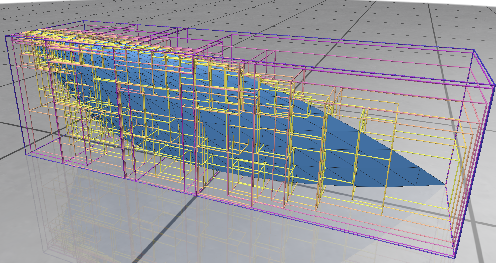

Before we can apply ML to the [triangle problem](), we need to be able to
compute self-intersections of a curved triangle in an accurate and efficient way so that we can generate enough training data.

The basic approach is:
1. [Subdivide](#subdividing-the-triangle) the curved triangle into smaller subtriangles
2. [Find](#finding-candidate-pairs-using-a-bounding-volume-hierarchy-bvh) potentially intersecting pairs of subtriangles
3. [Check](#finding-true-intersection-pairs) for actual intersections among these candidate pairs

## Subdividing the triangle

We split the original triangle into a list of sufficiently flat subtriangles by a simple recursive
procedure, starting with the full triangle ``{(0,0), (1,0), (0,1)}``:

1. If the triangle is sufficiently flat, add it to the list and return.
2. Otherwise, split the triangle into four child triangles by connecting the three edge midpoints to each other
   and recurse into each of them.

<figure style="max-width:100px; margin-left:auto; margin-right:auto">

```goat
+
|\
| \
|  \
+---+
|\  |\
| \ | \
|  \|  \
+---+---+
```
</figure>

*A sketch of the subdivision scheme.*

This results in a list of subtriangles, given by their three vertices in (u,v)-parameter space, that are
considered flat enough and cover the entire original triangle.

To check if a triangle is "flat enough", we can compute the normal distance of its curved edge midpoints
from the plane defined by its three vertices and compare it to a threshold. It's also a good idea to compute the
distances of the curved edge midpoints to the corresponding linear midpoints in order to exclude triangles that are
planar, but have highly curved edges.

Having sufficiently flat triangles gives us two things:
- Flat triangles can neither have self-intersections nor intersect neighboring flat triangles.
- We can check for intersections between flat triangles via a standard triangle-triangle intersection check
  ([e.g., Devillers-Guigue](https://raw.githubusercontent.com/erich666/jgt-code/master/Volume_08/Number_1/Guigue2003/tri_tri_intersect.c)).

So, as a result of Step 1, we have:
```C++
using SubTriangle = std::array<Eigen::Vector2d, 3>; // Three (u, v) points

std::vector<SubTriangle> subTriangles;              // List of all subtriangles
```

However, checking all pairs of subtriangles against each other is too expensive (\(\mathcal O(n^2)\), with
``n = subTriangles.size()`` routinely in the thousands or tens of thousands), even when preceded by
a cheaper bounding box check. We need a spatial data structure to speed it up.


## Finding candidate pairs using a Bounding Volume Hierarchy (BVH)

A [BVH](https://en.wikipedia.org/wiki/Bounding_volume_hierarchy) is a spatial tree structure, somewhat similar to an
[octree](https://en.wikipedia.org/wiki/Octree) or a [BSP tree](https://en.wikipedia.org/wiki/Binary_space_partitioning),
which is often used for collision detection and raytracing. Every node of the tree has a bounding box which contains all
its children. Leaf nodes contain one (or a few) triangles. Non-leaf nodes don't directly contain triangles, but have
two child nodes, a "left" and a "right" one. The bounding boxes of the two child nodes can overlap each other, but are
both contained in the parent's bounding box.

We construct such a BVH tree for the list of flat subtriangles of our triangle.
Constructing the tree is another recursive procedure, starting with the total list of subtriangles:
1. Compute the bounding box for the given triangles.
2. If the list contains only one triangle, construct a leaf with this triangle and its bounding box.
3. Otherwise, separate the triangles into a "left" and a "right" group by finding the longest axis of
   the bounding box, sorting the triangles by their center point along that axis, and splitting the sorted list at the median.
   Construct a non-leaf node by recursively calling the BVH construction function for the left and right groups.



The above screenshot shows a BVH tree for a curved triangle, with the depth of each node visualized as the color
of its bounding box. The core recursion for building the tree is strikingly simple:

```C++
std::unique_ptr<BVHNode> BVH::buildBVH(const CurvedTriangle& triangle, const std::vector<SubTriangle>& subTriangles, size_t maxLeafSize) {
    auto node = std::make_unique<BVHNode>();

    // Compute the bounding box for all sub-triangles
    node->bbox = computeBoundingBox(triangle, subTriangles);

    if (subTriangles.size() <= maxLeafSize) {
        // Leaf node: store triangles and stop recursion
        node->triangles = subTriangles;
    } else {
        // Internal node: split and recurse
        auto [leftTriangles, rightTriangles] = splitTriangles(triangle, subTriangles, node->bbox);
        node->left = buildBVH(triangle, leftTriangles, maxLeafSize);
        node->right = buildBVH(triangle, rightTriangles, maxLeafSize);
    }

    return node;
}
```

Once we have the BVH tree, finding pairs of subtriangles whose bounding boxes may intersect is simple, and yet another recursion:
given pointers ``a`` and ``b`` to BVH nodes, we terminate the recursion if ``a->bbox`` and ``b->bbox`` do not
intersect. Otherwise, we recurse into the children of both nodes until we reach a situation where both pointers
refer to leaf nodes; then, we add all pairs formed from triangles in ``a`` and triangles in ``b`` to the list of
candidate intersection pairs.

The BVH tree reduces the complexity of finding these candidate pairs from quadratic to \(\mathcal O(n \log n)\),
where \(n\) is the number of subtriangles. That's almost linear and a huge gain. So after Step 2, we have:

```C++
std::vector<std::pair<SubTriangle, SubTriangle>> potentialPairs;
```

## Finding true intersection pairs

Having obtained a list of pairs of subtriangles which may intersect each other according to their bounding boxes, we simply check
each pair using a standard triangle-triangle intersection algorithm; I used an existing implementation of the
[Devillers-Guigue algorithm](https://raw.githubusercontent.com/erich666/jgt-code/master/Volume_08/Number_1/Guigue2003/tri_tri_intersect.c).
We ignore the curvature here since by construction, we found these subtriangles to be sufficiently flat.

There is one wrinkle: triangles which neighbor each other in parameter space will always intersect because they share (parts of)
an edge or a vertex; but they cannot have nontrivial intersections due to our flatness assumption.
To avoid these spurious intersections, we discard pairs of triangles whose parameter-space bounding boxes intersect.

As a result, we obtain the list of truly intersecting pairs of subtriangles:

```C++
std::vector<std::pair<SubTriangle, SubTriangle>> intpairs;
```

If this list is nonempty, our original triangle does have self-intersections.

## Summary

Through the pipeline of

&nbsp; triangle subdivision &LongRightArrow; bounding box collision check &LongRightArrow; triangle intersection check,

we can determine if a given curved triangle has self-intersections in a relatively efficient way.

Next up: confirming our intersections and [making them more accurate]()
through the power of Gauss-Newton.
