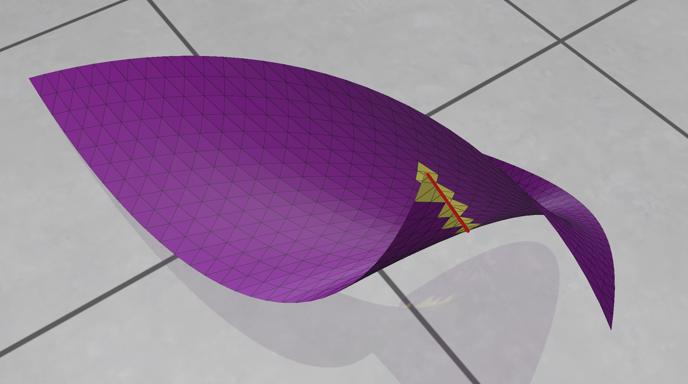

In the [last post](), we found pairs of subtriangles of our
[curved triangle]() which intersect.
The subtriangles were linear approximations, which means that the intersection points we found are also only approximate.
This might be good enough for our purposes, but in the interest of getting training data that's as accurate as possible, we will
refine these intersections by projecting them onto the exact curved triangle.

To be precise, we are looking for two distinct parameter pairs \((u_1, v_1)\) and \((u_2, v_2)\) within the triangle's domain such that their mappings coincide,

\[
  T(u_1, v_1) = T(u_2, v_2).
\]

This is a classic root-finding problem, and we'll use the [Gauss-Newton method](https://en.wikipedia.org/wiki/Gauss%E2%80%93Newton_algorithm) to solve it.
That same method is also used for non-linear regression, but we use it for a completely non-statistical purpose here!


## The optimization problem

We want to find a vector of parameters \(\mathbf{x} := (u_1, v_1, u_2, v_2)^T\) such that the residual \(\mathbf{r}(\mathbf{x})\) is zero:

\[
  \mathbf{r}(\mathbf{x}) := T(u_1, v_1) - T(u_2, v_2) = 0
\]

Unlike in a classical application of Newton's method, here the input is four-dimensional, but the output is only three-dimensional.
In other words, we have four unknowns, but only three equations---our problem is underdetermined.
In geometric terms, this simply means that in general the intersection is not a point, but a curve!
That's fine for us, though---for now we are only interested in finding any point that lies exactly on that intersection curve.

A standard approach for underdetermined problems is to treat it as a least-squares problem, i.e., minimize the squared residual \(\|\mathbf{r}(\mathbf{x})\|^2\);
the Gauss-Newton algorithm is designed to do exactly that.


## The Gauss-Newton iteration

Let \( J(\mathbf x) \in \mathbb R^{3\times4} \) denote the Jacobian matrix of \( \mathbf r(\mathbf x) \).
Starting from an initial guess \(\mathbf{x}_0\), the Gauss-Newton algorithm iteratively refines the estimate using the update rule

\[
  \mathbf{x}_{k+1} = \mathbf{x}_k + \Delta \mathbf{x}_k,
\]

where the update step \(\Delta \mathbf{x}_k\) is the solution to the linear system

\[
  J(\mathbf{x}_k)^T J(\mathbf{x}_k) \Delta \mathbf{x}_k = - J (\mathbf{x}_k)^T \mathbf{r}(\mathbf{x}_k).
\]
(This is the only difference to the standard Newton's method---it would solve \( J \Delta \mathbf x=-\mathbf r \), but since that is underdetermined,
Gauss-Newton solves the [linear least squares](https://en.wikipedia.org/wiki/Linear_least_squares) version of that instead.)
The iteration is stopped once \(\|\mathbf{r}(\mathbf{x})\|\) , the distance between the points, falls below a threshold, say \(10^{-9}\).

The Jacobian matrix \(J(\mathbf{x})\) can easily be written in terms of the Jacobian of the curved triangle map
\( \nabla T(u, v) \in \mathbb R^{3 \times 2} \) as

\[
  J(\mathbf{x}) = \frac{\partial \mathbf{r}}{\partial \mathbf{x}} =
  \begin{bmatrix}
    \nabla T(u_1, v_1)  &  -\nabla T(u_2, v_2)
  \end{bmatrix}.
\]
Computing \( \nabla T \) is an easy exercise since \(T\) is polynomial; here's the member function for our ``CurvedTriangle`` class:

```C++
    Eigen::Matrix<double, 3, 2> jacobian(double u, double v) const {
        Eigen::Vector3d a = P200 + P002 - 2 * P101;
        Eigen::Vector3d b = P020 + P002 - 2 * P011;
        Eigen::Vector3d c = 2 * P110 + 2 * P002 - 2 * P101 - 2 * P011;
        Eigen::Vector3d d = -2 * P002 + 2 * P101;
        Eigen::Vector3d e = -2 * P002 + 2 * P011;

        // Compute partial derivatives
        Eigen::Vector3d dTdu = 2 * a * u + c * v + d;
        Eigen::Vector3d dTdv = 2 * b * v + c * u + e;

        Eigen::Matrix<double, 3, 2> J;
        J.col(0) = dTdu;
        J.col(1) = dTdv;
        return J;
    }
```


## Putting it together

Now we have all the pieces in place and can implement the Gauss-Newton method to compute precise intersection points. A few more details we have to take into account:

1. **Initial guess:** For each pair of intersecting subtriangles, we use their centroids in
   (u,v)-parameter space as the initial guess for \((u_1, v_1)\) and \((u_2, v_2)\).
   By the way, that's the reason we couldn't use Gauss-Newton initially to compute intersection points without doing all that
   geometry in the [previous post]() first: Newton iterations are known to converge very quickly, but only
   if the initial guess is already in the neighborhood of the exact solution. Otherwise, they are prone to diverging.

2. **Solving the linear system:** Directly inverting \(J^T J\) can be numerically unstable if the matrix is ill-conditioned
   (e.g., if the tangent planes at the two points are nearly parallel).
   It's a better idea to use a stable method like SVD (Singular Value Decomposition) to solve this system.
   We'll see a second benefit of this approach in the next section.

3. **Parameter domain constraints:** The parameters \((u, v)\) have to satisfy \(u \ge 0, v \ge 0, u+v \le 1\).
   If an update step takes a parameter outside this domain, we have to project them back into the parameter space triangle.

4. **Distinctness:** If the two parameter points of our initial guess are too close together, it could happen that after convergence we
   end up with \( (u_1,v_1) = (u_2,v_2) \). In that case we didn't find a real intersection and have to discard the point.

5. **Spurious intersections:** Since the subtriangles we started with were only linear approximations, in rare cases it can happen
   that they intersect, but the real surface \(T\) doesn't. In such cases the Gauss-Newton method doesn't converge, and again we discard these points.


## Bonus: tracing out the intersection curve

Remember that the self-intersection usually takes the form of a curve. Until now we found one point
\(\mathbf{x} = (u_1, v_1, u_2, v_2)^T\) whose image lies on that curve. What if we want the entire curve?

The answer lies, again, in the Jacobian \(J \in \mathbb R^{3\times4} \). When we compute the SVD of that matrix,
we typically get three right singular vectors \(\mathbf v_1, \mathbf v_2, \mathbf v_3 \in \mathbb R^4 \)
associated to nonzero singular values, and a fourth one, \(\mathbf v_4 \in \mathbb R^4 \),
which lies in the nullspace of \(J\). That means that moving away from \(\mathbf x\) in the direction
of that vector, the gradient of \(\mathbf r(\mathbf x)\) is zero in that direction.
But a zero gradient means a constant function \(\mathbf r\), which implies that a small step in direction \(\mathbf v_4\) leaves us
(approximately) on the curve! We can simply project that new point
\(\mathbf{x}' = \mathbf{x} + \varepsilon \mathbf v_4 \) back onto the curve exactly using our Gauss-Newton method and
then continue this process: compute nullspace vector, take a small step, project back. Like this we can trace out the entire
self-intersection curve.


*A self-intersection curve (in red) plotted out in 3D space. Intersecting subtriangles are shown in yellow.*

This class of algorithms is known as predictor-corrector methods, or [numerical continuation](https://en.wikipedia.org/wiki/Numerical_continuation).
Working out all the details is beyond the scope of this article, but the method is implemented in the code repository which
I'll put online soon.


## Summary

By formulating the self-intersection condition \(T(u_1, v_1) = T(u_2, v_2)\) as a root-finding problem \(\mathbf{r}(\mathbf{x}) = \mathbf{0}\),
we can use Gauss-Newton to refine the approximate intersections we found geometrically.
This allows us to confirm that what we found is actually a self-intersection and improves the accuracy of our data.
We even saw that we can use an extension of this idea to trace out the entire curve along which the triangle intersects itself.
