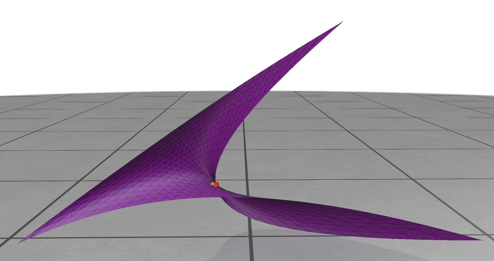

As the starting point for a little machine learning project, I chose the following geometric problem.
We are given a curved triangle in 3D space.
It's specified via its three vertices plus three additional vector-valued coefficients associated to its three edges.
These coefficients are interpreted as control points of a quadratic triangular Bezier surface.
Such representations are commonly used in CAD systems to represent curved surfaces.
Mathematically speaking, we map parameters \((u,v)\) which lie in the parameter-space triangle \( 0 \le u, v;\ u+v \le 1\) to

\[
T(u,v) = P_{200} u^2 + P_{020} v^2 + P_{002} w^2 + P_{110} 2uv + P_{101} 2uw + P_{011} 2vw,
\]

where \(w = 1 - u - v\) is the third barycentric coordinate,
\( P_{200}, P_{020}, P_{002} \) are the 3D vertices,
and \(P_{110}, P_{101}, P_{011} \) are the edge control points.


Here's the beginning of a simple implementation in C++ of that concept, using the [Eigen](https://eigen.tuxfamily.org/index.php?title=Main_Page) library.

```c++
class CurvedTriangle {
public:
    CurvedTriangle(const Eigen::Vector3d& p200, const Eigen::Vector3d& p020, const Eigen::Vector3d& p002,
                   const Eigen::Vector3d& p110, const Eigen::Vector3d& p101, const Eigen::Vector3d& p011)
        : P200(p200), P020(p020), P002(p002), P110(p110), P101(p101), P011(p011) {}

    Eigen::Vector3d map(double u, double v) const {
        double w = 1 - u - v;
        return P200 * (u * u) + P020 * (v * v) + P002 * (w * w)
             + P110 * (2 * u * v) + P101 * (2 * u * w) + P011 * (2 * v * w);
    }
	
    Eigen::Vector3d P200, P020, P002, P110, P101, P011;
};
```

Now unlike linear triangles, it's possible for these curved triangles to have self-intersections, that is,
parameter values \( (u_1,v_1) \ne (u_2,v_2) \) such that \(T(u_1,v_1) = T(u_2,v_2)\).
Here's a curved triangle without self-intersection:


And here's one that does self-intersect:


## The problem

The question is simple: given the six vectors determining the triangle, can we find out if it self-intersects?

## The approach

First up we [develop an algorithm](), using some computational geometry,
to check for self-intersections. Once that is done, we can generate as
much input data as we like for an ML approach and see if we can come up with a good model.

Although both inputs (a couple of floats) and output (just a binary classifier) for this problem are simple,
the problem isn't trivial: the decision boundary we are trying to learn is highly nonlinear.
So it should serve as an interesting test case for learning about ML techniques while still being
quick to experiment on using commodity hardware.
