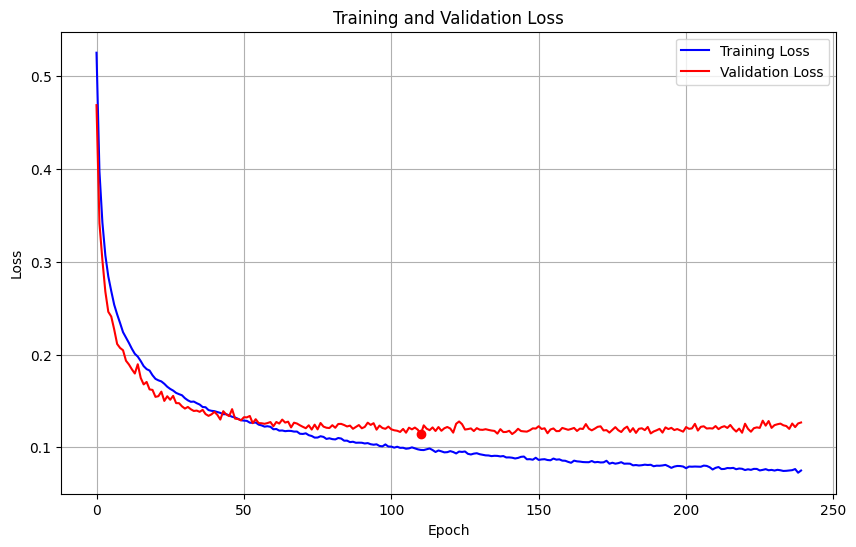

Now that we have plenty of [training data](), we can load it into PyTorch and
start training a model.

## Loading the data

Since the binary file format we chose was so simple, it's rather straightforward to write a ``Dataset`` class which
reads it in:

```py
import numpy as np
import torch
from torch.utils.data import Dataset, DataLoader, Subset

class BinaryBezierDataset(Dataset):
    """
    Loads Bezier triangle data from a binary file into memory once.
    Each record: 11 float32 coords, 32 uint8 bytes (packed 16x16 bitmap).
    """
    def __init__(self, filename, device, input_dim=11):
        super().__init__()
        self.filename = filename
        self.input_dim = input_dim
        coords_bytes = input_dim * np.dtype(np.float32).itemsize  # 44
        record_bytes = coords_bytes + 32       # 76 (coords + 16x16 bitmap = 256 bits)

        # Calculate number of samples from file size
        file_size = os.path.getsize(filename)
        if file_size % record_bytes != 0:
            raise ValueError(f"File size {file_size} not multiple of record size {record_bytes}")
        self.num_samples = file_size // record_bytes

        print(f"Found {self.num_samples} samples in {filename}.")

        with open(filename, 'rb') as f:
            data = np.fromfile(f, dtype=np.uint8, count=file_size)

        data = data.reshape(self.num_samples, record_bytes)    # reshape into records

        # Extract coords (first 44 bytes = 11 floats)
        coords = data[:, :coords_bytes].view(np.float32).reshape(self.num_samples, self.input_dim)

        # Extract and unpack packed bitmaps (last 32 bytes)
        packed_bitmaps = data[:, coords_bytes:]
        unpacked_bits = np.unpackbits(packed_bitmaps, axis=1)  # (num_samples, 256)

        # The actual label is the maximum (0 or 1) over the bitmap bits
        outputs = np.max(unpacked_bits, axis=1)     # (num_samples,)

        # Convert to pytorch tensors and transfer to GPU if required
        self.x_tensor = torch.from_numpy(coords).float().to(device)   # (num_samples, 11)
        self.y_tensor = torch.from_numpy(outputs).float().to(device)  # (num_samples,)

    def __len__(self):
        return self.num_samples

    def __getitem__(self, idx):
        return self.x_tensor[idx], self.y_tensor[idx]
```

So far, so good. We are in the convenient position that our entire dataset fits quite comfortably into RAM or VRAM,
so we just load the entire dataset at once, extract the 11 triangle coordinates, unpack the bitmap and take its maximum
to get a binary 0/1 label which tells us whether the triangle self-intersects. This is a pretty straightforward
``DataSet`` which we can load into a ``nn.DataLoader`` with the desired batch size and shuffling enabled to feed a
standard PyTorch training loop. It's actually not very efficient to use it like this, but we'll get to that in a later post.


## Designing the model

Quite frankly, my first attempt at designing a model was a bit overwrought. After a brainstorming session with Gemini 2.5 Pro,
I drafted a model which would predict the 16x16 intersection curve heatmap described in the previous post instead of
just the binary classifier. It consisted of some dense MLP layers of increasing size, until their output would be reshaped
to 64 channels with a 4x4 resolution. Then a series of transposed convolution layers would successively upscale and reduce the
number of channels until we arrived at a 1x16x16 image, which would be compared to the bitmap label via Dice loss.

It's not that this design was a total failure; after training, it did make some reasonable predictions.
But in the end it was slow to train relative to its number of parameters, the accuracy wasn't particularly good, and it simply
felt too complex for a first attempt.

At such times it's a good idea to think back on the [wisdom of Andrej Karpathy](https://karpathy.github.io/2019/04/25/recipe/):
don't be a hero when it comes to model design. Our goal is to classify, so let's stick to a single output neuron with a
sigmoid activation. In between our input layer with 11 floats and the output, let's just do the simplest thing that could
possibly work: a sequence of \(H\) hidden, fully connected MLP layers with a fixed number \(n\) of neurons each.

```goat {caption="A single MLP layer for our first model."}
    +----------.    +----------.    +----------.    +----------.    
*-->|  Linear   |-->| BatchNorm |-->|   ReLU    |-->|  Dropout  |-->*
     '----------+    '----------+    '----------+    '----------+   
```

Each layer consists of a standard linear layer followed by batch normalization, ReLU activation and dropout.
It's generally considered not ideal to combine BatchNorm with dropout, but in our case, due to
non-noisy data, being able to choose large batch sizes because our inputs are small, and using only very low
dropout rates seems to make the combination work quite well.

Here's the Python function which instantiates our parameterized model:

```py
def simple_mlp_model(inputdim, numlayers, numneurons, dropout_rate):
    layers = [
        nn.Linear(inputdim, numneurons, bias=False),
        nn.BatchNorm1d(numneurons),
        nn.ReLU(),
    ]
    for k in range(numlayers):
        layers += [
            nn.Linear(numneurons, numneurons, bias=False),
            nn.BatchNorm1d(numneurons),
            nn.ReLU(),
            nn.Dropout(p=dropout_rate),
        ]
    layers += [
        nn.Linear(numneurons, 1),
        nn.Sigmoid()
    ]
    return nn.Sequential(*layers)
```

Another useful little detail here is that we deactivate the bias terms on linear layers directly before
BatchNorm layers since the latter provide their own bias term. It's not a huge thing, but it does save a few parameters.

Our loss function is ``binary_cross_entropy``, and for training the model, we use the ``AdamW`` optimizer
from PyTorch.
For now we don't use any weight decay because in my first tests it didn't seem to be beneficial.
The training loop is pretty standard PyTorch fare, and I won't reproduce it here in its entirety.

## A first run

After all that setup, it's time to start a first training run. Let's use 5 hidden layers with 256 neurons each;
this model has around 333k parameters, so pretty quick to train.
We use a learning rate of \(10^{-3}\) and a dropout rate of \(p = 0.04\).
We train and validate using the 900,000 and 20,000 examples, respectively, described in the previous post.

Here's the plot of training and validation loss over the entire training run:



We use a simple kind of early stopping here based on keeping the model with the best validation accuracy and stopping
if no improvements were made in the last 50 epochs.
The best validation accuracy is achieved at epoch 188, with **95.44% accuracy** on the validation set and a validation
loss of 0.1149. That's pretty nice for a first run! Granted, I chose these hyperparameters not randomly,
but based on experience from some earlier experimental runs, so they already yield decent results.

The model is already overfitting here, but the validation loss isn't suffering dramatically from it yet. We could try
increasing the dropout rate or introducing some other kind of regularization, but we'll get into a slightly more principled
hyperparameter search later on.

Also note that the red dot marks the lowest validation loss, 0.1139, which happens earlier (epoch 111)
but has a slightly lower accuracy of 95.12%.

This looks like a great starting point, and we will tweak various aspects of our setup from here on out.
